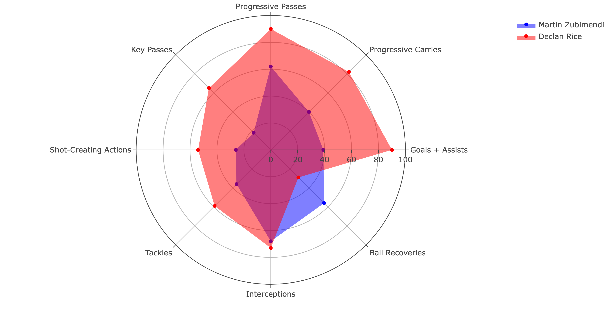
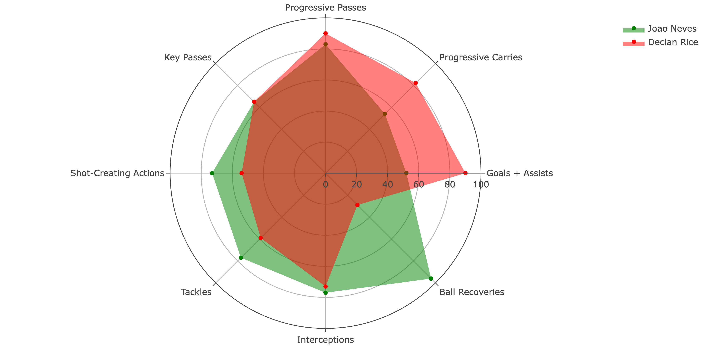
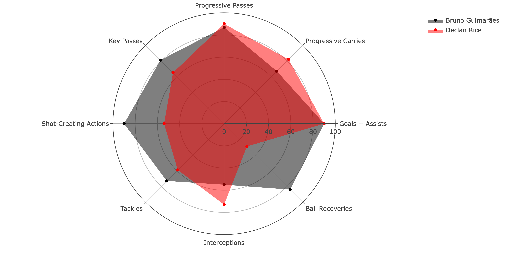
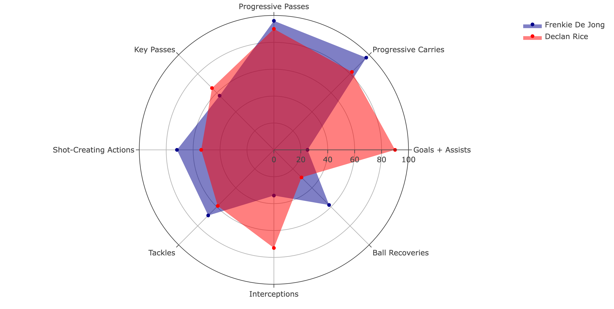
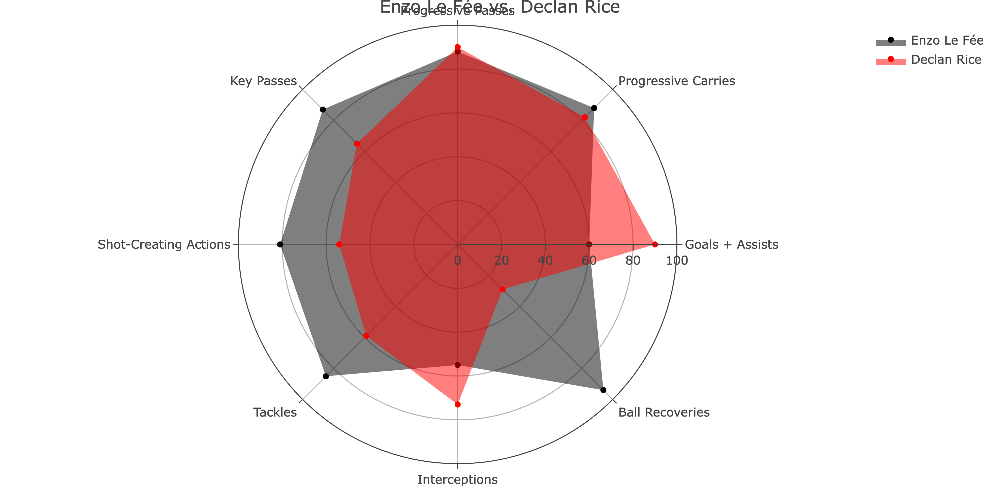
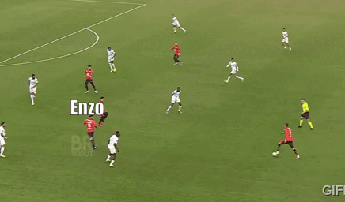
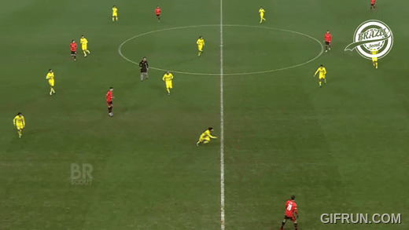

## Arsenal Transfer Files: Who to Target for their Midfield?

Arsenal’s season came to a close this past weekend with the Gunners
taking second place in the Premier League for the second year in a row
and making the quarterfinals of the Champions League. Reports suggest
that the club will get roughly 200M euros for their placement in the PL,
and 91M euros for their UCL campaign, adding up to about 291M euros
worth of prize money for their season. That is not a bad haul for the
club. Obviously this won’t all be put towards transfers, but Arsenal are
set to be active in the transfer market once again to try and finally
push them over the edge to take home some hardware next season. The club
is set to try and obtain reinforcements in each phase of play: a backup
goalkeeper, a defender (most likely left sided), a midfielder, and an
attacker. In January, it was thought that the club would look to splash
the majority of their budget on a striker. I personally was never
convinced that a proverbial true number 9 such as Victor Gyokeres or
Alex Isak would be the answer to all of our problems, and now with the
performances of Kai Havertz (15 G/A in his last 13 games), it looks like
there may be more pressing issues to address.

Personally, I feel that Arsenal’s midfield should be the area that they
focus heavily on. In 2024 when they began to really pick up form, the
midfield mostly consisted of Thomas Partey playing the lone 6 role, with
Declan Rice moving further up the pitch as the left sided 8, and Martin
Ødegaard playing a hybrid 8/10 role on the right. There was a clear
tactical shift from the 2022/23 season to this most recent one. In
2022/23, Oleksandr Zinchenko was a key player, meandering around the
pitch on offense and creating overloads in positions to help breakdown
opposing defenses. This worked brilliantly, as Arsenal broke their
premier league goal record with 88 goals for, but also allowed 43 goals
against, as Zinchenko’s offensive antics also left Arsenal open at the
back. So to rectify this, Arteta played Zinchenko a lot less (2,136
minutes in 22/23, 1,725 in 23/24) and instead played center back hybrids
Takehiro Tomiyasu and Jakub Kiwior at left back. The defense was much
better this year with the change, only letting in 29 goals against. The
introduction of Declan Rice was also helped improve the defense and the
control Arsenal had on games.

The changes in the midfield went a long way in fixing some of Arsenal’s
issues. However, even though Jorginho has just renewed his deal, he is
still 32 years old, and Thomas Partey will be 31 while also having
fitness issues. Combine that with the uncertain futures of Emile
Smith-Rowe and Fabio Vieira, Arsenal are going to need at least one
reinforcement in that area. For me there is a question of whether this
signing should be a more attacking focused 8, or a more defensive
focused 6. Last summer, It looked like Arteta went the 8 route with Kai
Havertz, but that didn’t work, and Declan Rice has played well as an 8
this season. I will offer relatively brief analysis and opinions on a
few prospects that fit a few different styles and provide my opinions on
which direction Arsenal should go. Deeper dives will come for a few of
the more heavily touted prospects.

## True 6s

The following 2 players would be best suited to play the lone 6 role at
the base of Arsenal’s midfield. The player in this role needs to be
sound defensively; they need to be great tacklers while also reading the
game as it comes to them to step into passing lanes to intercept passes
after the 10 and 8 are bypassed. They need to be comfortable on both
sides of the field and cover a lot of lateral ground. Offensively they
need to be comfortable with the ball under pressure, often playing with
their back to the play. They need to take in information and make the
right decision in a split second.

### Martin Zubimendi

One of the top defensive midfield prospects in club football at this
moment, Martin Zubimendi is reported to be near the top of Arteta’s
shortlist and for good reason. The Spanish midfielder is 25 years of age
and has become on of the first names on the Real Sociedad team sheet. He
fits the profile of player that Arsenal typically look for. There are
many strengths to his game but a few weaknesses as well.

#### Offensive Ability

Zubimendi is a true Spanish 6, often drawing comparisons to Sergio
Busquets. He is very composed under pressure and considered an elite
passer.

His stats don’t really jump out as anything fantastic, but that is often
the case with this type of player. Watching him play he’s very smooth
and composed on the ball, but he makes his task look relatively simple,
so if you aren’t paying attention, you may not realize what he’s doing.
His task on offense is to connect the defense to the attack in buildup.
He does so by taking up deep central positions.

As you can see here, he is surrounded by 4 defenders, but still he wants
the ball. He is very adept at providing his teammates with a pressure
release valve that, speaking as a former center back, is very
appreciated. From here he either turns and passes forward himself, but
more often he plays the way he faces and gives the ball to someone with
more time and space. As most Spanish players are taught, he keeps it
simple and tidy, using the pace of the ball to bypass defenders rather
than dribbling or other more complicated methods.

#### Defensive Ability

Defensively his task is to breakup play and cut passing lanes as a
protective layer in front of the center backs. At the base of the
midfield, his main job is to intercept passes and slow down the
opposition once they bypass the attackers. Here is an example:

The opposition has bypassed the forward line as well as the more
attacking midfield players. Zubimendi is the last player before the
defense to stop a developing attack for the opposition.

He does well, as the angle he takes forces the player wide and
ultimately into a duel, which Zubimendi wins. His understanding of his
position and space allow him to shut down attacks before they start.
This is a quality Arteta no doubt loves; when his players lose duels, he
gets upset and Zubimendi does well in his. He is in the 81st percentile
for percentage of dribblers tackled.

The main downside to his play is his physicality. He is a silky player,
not an imposing one, which could hinder his success in the premier
league. Premier league games are also often faster paced, and in some of
the more end-to-end games they have played in such as the UCL knockout
ties against PSG, those games kind of passed him by. The thing that
probably sinks this transfer is his reluctance to leave Spain. Arsenal
have been rumored to be willing to pay the release clause of 60M euros,
but Zubimendi has been tipped to go to Barcelona and is also happy at
Sociedad. If he were to come to the Emirates, he could slot into the
number 6 role that Partey currently plays with ease. He is certainly an
option, but their are probably easier, and better deals to be done

### Joao Neves

The next prospect is the latest gem from the Portuguese talent factory
that is Benfica. Joao Neves is just 19 years of age, but you’d never
know that watching him play. He is everywhere on the defensive side of
the ball, making tackles and interceptions all across the pitch. Though
he stands at just 5’9”, he imposes himself on every game.

Tactically, Benfica set up in a 4-2-3-1 most often, and Neves plays as
part of a double pivot. This means that Neves has a more opportunity to
wander forward and be more involved in the attack, as the second half of
his pivot can cover him defensively. As you can see in the figure above,
he is a very well-rounded player and has a tremendous ability to control
games.

#### Offensive Ability

With the ball, Joao Neves is a very calm, tidy player. Benfica play very
fluidly, so he pops up in different areas all across the pitch looking
to get on the ball. He is a master at progressing the ball forward,
either by dribbling or passing.

  

Here he uses spectacular awareness and technique to break two lines of
defense a take almost every defender out of the play. His brain works
fast, as he recognizes the run and the fact that he needs to play the
pass one touch before the passing lane closes and his runner becomes
offside, and executes it to perfection. Neves is an elite and
high-volume passer as he is in the 98th percentile for passes attempted,
and 99th for passes completed.

Neves often progresses the ball through his dribbling skills as well. He
uses his diminutive stature to shield the ball and wriggle out of tight
spaces. Below is an example of him using this skillset

This is the area of his game that I feel sets him apart from the likes
of Martin Zubimendi. Instead of making a simple pass to just retain
possession, Neves bursts forward into space to launch an attack. He is a
very versatile player when it comes to progression on offense. He is
often seen as a 6 due to his low G/A output, but I believe he has the
skills to develop into an 8 if his next team needs him to.

#### Defensive Ability

Joao Neves does a lot of good work without the ball. Benfica are one of
the highest possesion teams in Europe with an average possession of over
59%, which Neves plays a large role in. Outside of being a great passer,
he is in the 99th percentile for tackles in the final 3rd, and 96th
percentile for tackles won period. This means that when Benfica lose the
ball, Neves is often able to win it back quickly and in dangerous areas.
On of his weaknesses is 1v1 defending, as he is not proficient at
tackling dribblers. His overall defensive game is very sound, but I do
worry about his size in the Premier League

Overall, Neves is a great all around midfielder who appears to have room
for growth as he gains more experienced. He is no doubt one of the top
midfield prospects in the world and wherever he goes, I believe he has
the tools to thrive. However, I don’t feel like it should be Arsenal.
He’s a great player, but I feel that he would be redundant, as he is
very similar to Declan Rice. Watching them both play they are both
proficient dribblers, good passers, and have a unique ability to control
and read games. They are both probably better suited for the 6 role, but
have some traits and adaptability to play the 8. Declan Rice is a more
experienced, premier league bred version of Joao Neves, and I think
Arsenal should look at a player that would offer something different to
the squad. Neves would also cost a sizable amount, as Benfica are stern
in negotiations, and he will not be short of potential suitors.

## The 8s

The next two players on the list are a little more versatile and have
some question marks about where they would be played in the midfield,
likely hinging on where Arteta envisions Rice playing. I believe that,
based on what I saw at the end of the season and from what I understand
about Arteta’s emphasis on controlling games, Rice will primarily lineup
as the 8 next season. However, I am of the opinion he should lineup at
the 6. When you watch Rice play, it is clear what his strengths are. One
of his strengths is his ball carrying, as he can release pressure by
going on one of his signature driving dribbles up the field as he winds
through the opposition press. This is something he would be able to do
much less as a 6. However, the biggest strength of his game is the way
he understands it defensively. Granted he was playing on a much lower
possession team, but in the 2022-2023 season, he was in the 93rd
percentile for Interceptions and dribblers tackled. He was a man among
boys at times the way he would pick off passes, make tackles, and just
stop attacks single-handedly. While he could play the 8 and grow into a
more offensive role, he is everything you need in a 6, and I still think
that his best performances came in that role for Arsenal, even if the
team wasn’t firing in all cylinders yet. Perhaps the coaching staff
feels that Rice can develop certain skills required to play the 8, but I
just don’t think it is where his skills are maximized, and these next
two players I feel have some defensive shortcomings that Rice doesn’t
have, while also having more to offer offensively.

### Bruno Guimarāes

The next player on the list is one that Arsenal fans will no doubt be
familiar with. Bruno Guimarāes is a 26 year-old Brazilian midfielder
from Newcastle who would cost roughly 80M-100M British pounds to bring
to the club. He has made an impression on many Arsenal fans (myself
included) with his on-field antics and dirty play in recent memory. The
midfielder is someone that Arteta likes, as he was heavily linked with a
move to the Emirates back in January 2022 for 40M British pounds before
signing with Newcastle. He has more than proven himself to be an asset
in the premier league, and you know what you are going to get from him
in the league, which is more than can be said for the previous two
prospects. So is he the right fit for Arsenal?

Newcastle’s tactical setup and gameplan is quite different from
Arsenal’s despite deploying a 4-3-3 as well. Guimaraes says he enjoys
playing further up the pitch, but with the suspension of Sandro Tonali,
he was often forced to play in the middle of their midfield 3. Newcastle
like to play on the transition, going forward and long as quickly as
possible. Their midfielders are tasked with covering a lot of ground,
and they play quite fluidly, often popping up in different areas on the
pitch, and they cover for each other. They don’t really look to possess
the ball unless they are in the attacking third. Because of this their
games often look a bit frantic, but this usually benefits them
especially if the raucous crowd of St. James’s Park is behind them.

A report from David Ornstein back in May suggested that Arsenal have
Bruno near the top of their list if they decide to recruit a 6, while
also noting that he could play the 8. I personally believe his best
position would be at the 8 for reasons I will delve into below.

#### Offensive Ability

Bruno’s biggest strengths with the ball are his dribbling and his
passing. Clearly this is the type of midfielder that Arsenal are looking
for, as every prospect on this list shares those traits. He has a great
understanding of space and angles, allowing him to use delicate touches
of the ball to remove defenders from his path. He is not the fastest
player on the pitch, but uses his strength and guile to make these long
dribbles forward. He has a great right foot for passing, and a nose for
an incisive pass, as reflected by his 89th percentile in shot creating
actions. It is rare that he operates as a 6 in the way that Zubimendi or
Partey do. While he is good under pressure, he rarely uses his weaker
left foot, which limits his effectiveness as a true 6 in my opinion.

I love this clip because I have visions of Martin Ødegaard slipping Saka
the same type of pass and like to think of how much Martinelli might
benefit from a passer of this caliber playing the 8 on his side. It’s a
small detail, but the he hesitates at first to draw Mainoo in and then
takes a slight tough around him just to change the angle, which shows a
great understanding of space.

This pass shows just how deadly he can be in the final third. He floats
a wonderfully weighted ball to the right winger for a chance on goal. In
one pass he takes out 8 tightly packed defenders. This type of defensive
setup is something that Arsenal see quite often, and this is the type of
pass that Granit Xhaka had added to his locker (his assist to Jesus in
the Brentford away fixture comes to mind). Although He definitely needs
to work on his weak foot, there are no doubts about Bruno’s ability on
the ball.

#### Defensive Ability

Bruno’s defensive ability worries me a bit if he were to play the 6. I
hesitate to call him a 6 because it is almost as if each Newcastle
midfielder is responsible for a horizontal area of the pitch rather than
a traditional vertical one. What I mean by this is that when watching
their games near the end of the season against Brentford and Brighton,
he winds up pressing really high when the opposition plays it to their
defensive midfielder. He loves to press players when they have their
back to goal, and is really aggressive in doing so.

These are two instances where Bruno successfully wins the ball. However,
the more common outcome of these aggressive tackles is a foul either
because he goes in too hard, or because his athleticism fails him and he
is forced to make a tactical foul. Sometimes the tactical-ness of the
foul is quite questionable, as seen below

While the clip above is an extreme, it does expose a flaw in his game.
He wouldn’t be asked to do quite this much pressing as a 6 at Arsenal,
but I’d be worried about how much ground he’d have to cover. A lot of
these errors are a result of him not being able to get to the opposition
player fast enough. Partey already struggles with this sometimes which
leaves fans frustrated. I persoanlly had flashbacks of KDB outpacing
Partey to open the scoring at the Etihad in 2023 analyzing his
athleticism. He’s a good tackler, but I do not love his overall
defensive game.

Overall, I think Bruno is a good player. An 80M pound player, maybe, but
only if he were played as an 8, which he admits is where he likes to
play. It just would not make sense to me to play someone with Bruno’s
offensive ability at the 6, and Rice’s defensive abiltiy at the 8. Throw
in the fact that he’s kind of an asshole and might not be the perfect
fit for the squad’s morale, I think there are better deals to be done. I
promise that I’ll get to a player or two that I think would be great
pieces of business for Arsenal, but I just don’t think this one would
be. Once again I’ll reiterate that whatever Arteta and Edu decide is the
right choice for the squad and I’ll be 100% behind it as they have given
me no reason not to be, but I can remain skeptical until it’s official.

### Frenkie De Jong

Up next is Frenkie De Jong. Currently playing for the finanical plagued
Catalan giants Barcelona, FDJ is rumored to be available for sale this
summer for around 70M pounds. The 27 year-old dutch player was highly
touted to become one of the next great midfielders when he transferred
out of Ajax in 2019, but he just has always remained surplus to
requirements at FCB. Even for such an experienced player there is some
confusion about where his best position is. He’s been tried a number of
times by a number of coaches as a single pivot, but they all end up
playing him elsewhere. Ronald Koeman, who has coached him for Barcelona
and the Dutch national team, is convinced that Frenkie must be played in
a double pivot to get the best out of him. While I don’t necessarily
disagree, Arsenal don’t usually employ that strategy, so he’d have to be
used in another way. Arteta could change his tactical setup, but I don’t
see the benefit of him doing that for one player, and I doubt he would.
According to the reliable @teamnewsandtix on Twitter, De Jong is a
player Arteta loves, so he must have a plan for the player should they
get him.

#### Offensive Ability

If you’ve watched football regularly, you most likely have some idea of
what Frenkie De Jong is about. His ball retention is top notch and he
has world class ability to cut open a defense via dribble or pass.

As you can see he is right up there with the elite passers on Arsenal
and in the world in terms of progressive passing as pass completion.
Some of the passes he completes are simply ridiculous and a joy to
watch. Just looking at a few games and a few highlights there are
endless examples to pick from.

I want to demonstrate his ability to break down a low block, something
that I’ve pointed out that Arsenal need to get better at. I’m think that
if I didn’t markup this picture and asked who Frenkie would pass it to,
2/3 of people at least would get it wrong. The oppostion are playing a
very low block, and Frenkie is offered three pretty simple passes, all
out to his right. Look at the body position of every defender, they are
prepared for FDJ to pop a pass out to the right, which means there will
be a little more space if he can play a pass back towards the left, and
I think he recognizes that. He pass over the top of three lines of
defense for what should’ve been an assist, but if you’ve watched
Barcelona play, you know they are a bit wasteful.

This is from the same game, and the same low block. He receives a pass
back from his teammate, who he sees take off. The key thing here is he
sees the run of his teammate, and he understands that the low block is
stagnant. He knows that if he can hit his runner at the right time, the
runner will be in behind. There isn’t a ton of time for him to set up a
perfect pass, so he quickly clips a trivela pass over the top of the
entire opposition team. It’s a ridiculous pass and that type of mental
processing is something that few players have.

This last clip displays another aspect of every elite passer’s game. To
some, this may just look like a flair pass that he played just to add a
little spice to the game and show off. But it’s more than that. His turn
is silky, but the weight of the pass to him is a little soft, which
allows the defender he turned to recover quickly and position himself
back in front of him. If he simply just turns and passes the defender
probably cuts out the pass. But Frenkie is one step ahead, and the small
role backwards freezes the defender just slightly, meaning the passing
lane is clear. This is so Ødegaard-esque and really shows his
understanding of space, and the consequence that every movement of the
ball has on that space.

I admittedly had too much fun researching his passes and I left little
time to discuss his dribbling ability. If you’ve watched him play, you
no doubt know that his signature move is a little hip drop turn where he
fakes as if he’s turning over his left shoulder, and spins back right
with he outside of his right foot. Defenders should know it’s coming,
but it works almost every time. He is nearly impossible to put under
pressure. He’s also been known to make similar long striding runs
forwards to Declan Rice.

The one interesting thing about the player is the time he takes on the
ball. Watching him play, you notice he often holds the ball for a long
period of time. I say interesting because I can’t tell if it’s a good or
bad thing. I don’t really think he dwells on it, I think he is just
looking to be incisive, but it can sometimes hurt his team’s structure.
Overall he is an exquisite offensive player and would greatly improve
the team’s ability to breakdown low blocks.

#### Defensive Ability

Unfortunately, Frenkie’s overall defensive ability is probably what has
held him back form becoming the world beater that he was tipped to grow
into. Statistics-wise, there isn’t really anything that jumps out at you
positively. I don’t think that he has very good positional awareness
when playing as a lone pivot. His tackling is fine, but he’s rarely in
position to make a tackle. He is just in the 5th percentile for
dribblers tackled per 90, and the 30th percentile for tackle success
rate. He also has a tendency to switch off. Let’s look at an example.

First off I want to give him the benefit of the doubt, as he has a ton
of space to cover. Gavi is being his aggressive self putting pressure on
the ball, and Oriol Romeu has been dragged very far wide. But Frenkie
just never looks behind him and sees the player behind him. He ball
watches for a solid 5 seconds before the pass is played.

Someone from the defense definitely could’ve communicated that to him
but at the end of the day while he was responsible for a lot of space,
there was only one player in that space and he was behind him, and
Frenkie failed to see him, and doesn’t put much effort in to correct for
that error in the ensuing action. Now as I pointed out, Barcelona are a
bit stretched here and in general, they play with looser tactics that
Arsenal. You almost never see any midfielder on Arsenal responsible for
this much space. I think with some more tactical rigidity and larger
emphasis on duels, Frenkie could improve his defensive awareness and
work-rate. He is also in the 81st percentile for both tackles made in
the final and middle thirds, which could point to some potential success
in a press such as Arsenal’s

For me, this is possibly the perfect player for that left 8 position for
Arsenal to take them to the next level. Imposing enough at 5’11”, the
ability to break down low blocks with his passing and creativity, or
blow past defenders with his superb dribbling and ball retention skills
provide a unique blend of Ødegaard and Rice, the perfect player to join
those two. The biggest downside is his age, as he is 27 now and will be
28 in October. He also missed a lot of time with 3 ankle injuries this
season. Arsenal are looking to replace Thomas Partey, not find Partey
2.0. But overall, I really do think that this is the level raising
player that Arsenal are looking for. On paper, Ødeagaard, FDJ and Rice
just might be the best midfield in Europe. Combine that with a potent
attack scoring 91 premier league goals, and a defense that only gave up
29 while not having Jurrien Timber, and there is little that could stop
that team.

## Enzo Le Fée

Besides Frenkie De Jong, this might be my second favorite player on the
list. My apologies for making you as the reader wait until the end to
find my favorite players, but that’s just how the chips fell. Le Fée is
probably not known by the majority of fans, so let me introduce you. The
Frenchman is 5’7” and 24 years old, but plays with physicality. He’s got
the offensive and defensive ability to play box-to-box. The trademark of
his game is his quick passing, but there is a lot to like as the stats
suggest. His footballing intelligence is off the charts and with a
market value of just 18M euros, it would be a low risk, high reward
transfer.

#### Offensive Ability

If you just went off of G/A output, which sadly a lot of casual fans do
these days, you might immediately write off Le Fée off. Although he is
in the 60th percentile for goals and assists, he finished with just 5
assists and no goals. However, this is a player that is superb
offensively both on the ball and off of it. One thing that has been
proven to set amateur midfielders apart from professionals is scanning.
Scanning for those who may not know is the act of looking over your
shoulder to take in information on what is behind you and where the
defenders are. This sounds fairly simple, but it’s pretty difficult to
do effectively, but Enzo is unbelievable with the timing of his scans,
and actually processing the information and forming a plan. Here’s an
example:

Enzo starts this clip in the middle of 4 defenders. He already knows
that the left winger is next to him on his right, so he scans over his
left shoulder to find his striker and check the defense. The timing of
his scan is crucial, as it occurs when the ball carrier takes a heavy
touch. Enzo knows that he can’t play a pass with the ball away from his
feet, so he knows he has time to make a quick scan. With the information
he’s gathered. He knows his striker is open, but he doesn’t have a lot
of time to get him the ball, so he just flicks it to him in one touch.
He also knows the outside back will crash when he gets the ball, so he
invites him in by receiving the pass and spins away. The return pass was
poor, but that doesn’t take away from Enzo’s brilliance in this action.

Here Rennes are building out of the back, and one of the center backs
has the ball. Enzo scans and sees that his defender is over his right
shoulder. He also recognizes that there is a lot of space behind the
opposition right winger. The winger steps up to defend the Rennes left
back, so Enzo receives the ball in the second image. His first touch
appears to not be great, but I think it’s a deliberate attempt to draw
his defender in. He shows him the ball to invite a challenge before
taking a big touch into space and scampering away. He’s now got acres of
space to attack, all because of his understanding of the game.

Here he uses his exceptional range of passing to put a teammate through.
His passing is excellent, whether it be cross-field switches or incisive
through-balls, his technique is always sublime. Here he looks towards
the center of the field as he’s receiving the ball. He sees one teammate
jogging towards him, and notices the right-center back for the
opposition following him. He knows this run will open up space for the
striker farther away, so he curves a one time pass just out of reach of
the defense to his teammate. Ranking in better than the 85th percentile
in progressive passing distance, passes into the final third, and passes
into the penalty area, he specializes in line-cutting passes such as
this one. This ability would come in handy for a team like Arsenal who
often face low blocks.

#### Defensive Ability

Listed at just 5’7” and 143 lbs, Le Fée’s stature could be classified as
diminutive. However, he makes up for it with strength and tenacity on
the defensive side of the ball and his footballing intelligence helps
him as well. What stood out to me most was his tackling. The above
figure compares progressive passes per 90 and tackles + interceptions
per90, and Enzo ranks very well. He often makes tackles by the sideline
while covering for his winger, using the line to his advantage. He’s
very aggressive, sometimes too much so. He’s by no means an elite
defender like a Declan Rice, but that’s why he’s an 8. He can do a very
solid job when asked. His tenacity and football intelligence would allow
him to pick up the nuances of Arsenal’s press with ease.

The downside to Enzo is that he hasn’t played at the highest level yet.
When looking at player who plays at a lower level club like Rennes (no
offense to Rennes), there are a few things that I like to look for to
judge whether or not they can make the jump to the absolute highest
level. The first thing would be the player’s G/A output. Le Fée doesn’t
really have that, but as a center-mid, I’m willing to cut him some
slack. The next question that needs to be answer is whether or not the
player looks a cut above those that he’s playing with. In my opinion,
Enzo passes this test with flying colors. He is so clearly two steps
ahead of everyone else on the pitch. Sometimes he plays passes that his
teammates aren’t even ready for because he’s the only one that thought
about. He looks like a player that could explode at a top team, and
Arsenal could be that team. They have the perfect opening for him, but
they may elect for someone a little more proven in this later stage of
their “project”. I personally wouldn’t hesitate to take the risk.

## Conclusion

<table style="width:97%;">
<colgroup>
<col style="width: 14%" />
<col style="width: 9%" />
<col style="width: 15%" />
<col style="width: 36%" />
<col style="width: 12%" />
<col style="width: 7%" />
</colgroup>
<thead>
<tr class="header">
<th style="text-align: center;">Player</th>
<th style="text-align: center;">Ideal Pos.</th>
<th style="text-align: center;">Pros</th>
<th style="text-align: center;">Cons</th>
<th style="text-align: center;">Price (pounds)</th>
<th></th>
</tr>
</thead>
<tbody>
<tr class="odd">
<td style="text-align: center;">Martin Zubimendi</td>
<td style="text-align: center;">6</td>
<td style="text-align: center;">
+ Plays 6 now

+ Passing
</td>
<td style="text-align: center;">
- Little Desire to leave Spain

- Physicality
</td>
<td style="text-align: center;">60M</td>
<td></td>
</tr>
<tr class="even">
<td style="text-align: center;">Joao Neves</td>
<td style="text-align: center;">6</td>
<td style="text-align: center;">
+ Ball Retention

+ Tackling
</td>
<td style="text-align: center;">
- Physicality

- Inexperience
</td>
<td style="text-align: center;">80M</td>
<td></td>
</tr>
<tr class="odd">
<td style="text-align: center;">Bruno Guimarāes</td>
<td style="text-align: center;">8</td>
<td style="text-align: center;">
+ Passing

+ Dribbling
</td>
<td style="text-align: center;">- Defending | 80M | | | - Athleticism
|</td>
<td style="text-align: center;"></td>
<td></td>
</tr>
<tr class="even">
<td style="text-align: center;">Frenkie De Jong</td>
<td style="text-align: center;">8</td>
<td style="text-align: center;">
+ Ball Retention

+ Dribbling
</td>
<td style="text-align: center;">
- Age

- Defensive Awarness
</td>
<td style="text-align: center;">70M</td>
<td></td>
</tr>
<tr class="odd">
<td style="text-align: center;">Enzo Le Fee</td>
<td style="text-align: center;">8</td>
<td style="text-align: center;">
+ Intelligence

+ Tackling
</td>
<td style="text-align: center;">
- G/A Output

- Competition Level
</td>
<td style="text-align: center;">25-30M</td>
<td></td>
</tr>
</tbody>
</table>

Having a complete midfield is necessary for teams that want to control
games in the way that Arsenal do. With certain players at the club
failing to lock down one of those positions, and others aging quickly,
Arsenal will need at least one reinforcement this summer, with perhaps
more down the line. Luckily for them, there are plenty of options to
choose from. Martin Zubimendi looks like a pure single pivot with a very
similar skill set to Thomas Partey. If they can convince the player that
Arsenal is the best spot for him, he could be a solid addition. João
Neves loves to control games from the 6 position by getting on the ball
as much as possible. As one of the best midfield prospects in the world,
he will likely command a fee in excess of 100M euros, a fee that Arsenal
may be reluctant to pay.

If Arsenal decide to move Declan Rice back to the 6 (which I believe
they should), there are a number of more attacking minded players
available. Bruno Guimaraes has experience as both a 6 and an 8, but I
believe his passing skills and lack of defensive ability make him better
suited as an 8, but I think there are better options. The aging Frenkie
De Jong is still a world class midfielder who is exceptional at
progressing the ball and breaking down defenses. If Arsenal feel he has
4-5 good years left in him, then I wouldn’t hesitate as FDJ is clearly a
level raiser for this midfield. And finally, while I have not seen any
links to him, Enzo Le Fée is a player that I have admired for a long
time. With a footballing intelligence that few can boast, combined with
silky passing skills and a tenacity defensively, I believe he may be
exactly what Arsenal need, while also saving them a tens of millions of
euros.

Arsenal have proven to be solid decision makers when it comes to
transfers in the past. I also think that Arteta does a great job setting
players up for success and creating an environment where it is easy for
players to reach there full potential. This is an important window for
Arsenal to finally get over the hump that is winning the Premier League,
and a new midfielder might just be what it takes.
